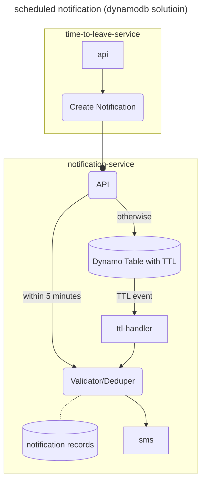
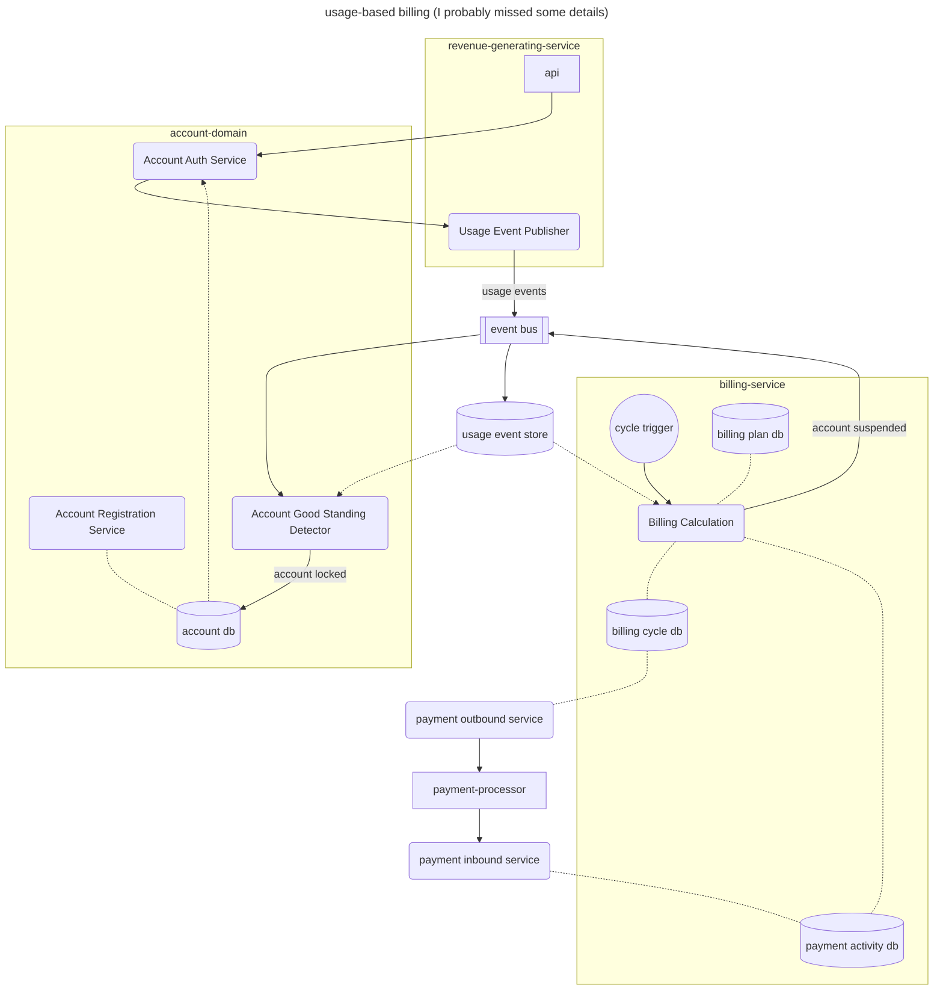

# Progress

## Step 1 - core function

* Create a function that takes a location and finds the nearest SEPTA Regional Rail train station using this data set: https://drive.google.com/file/d/11ZfHYz3w77-aM4ZQnQIxSSdxcGnWcFjA/view?usp=drive_link
  * The return format of the train station must be in GeoJSON.
  * Gives walking directions to the train station.
  * Sends SMS walking directions to a given telephone number if provided.

1. I started with Cursor.  I sent all the questions to Cursor, and it came up with 3 files:
- app.py: with APIs and api key validition with predefined keys in redis, and it put notification logic there, too
- station_finder.py: with a kml parser, logic to find nearest station, geojson (but only for station)
- a kubernetes file, which I didn't use, since I think based on usage pattern
    - it could be very popular, which means that we might need the ability to optimize its performance indepedent from other services in the company;
    - looking for train station sounds like most of traffic might be in day time, maybe especially around meal time?
    - we can start with a serverless function, and as we learn more about traffic pattern, we can switch to k8s if we need

1. Cursor didn't generate a working code, but it gave me a good starting point

1. I broke out external dependencies to adaptors, so that it makes testing easy and code less cluttered

1. I created a unit test to learn how data is structured and flowed

1. It didn't take me quite a while to understand some of the details, miles/meters, (lat, lon) and sometime (lon, lat), geojson, and etc.  Sometimes, I fed some questions to ChatGpt, Grok, Claude and DeepSeek, trying to learn faster. 

1. I haven't got the direction instructions working yet.  Still need to look into `project-osrm.org` 

## Setp 2, 3 - REST api

* Build an HTTP API that exposes that function.
* Add authentication to your API.

1. I started with `fastapi`, with predefined API keys in redis, and got it working with redis docker container

1. I created `serverless.yaml` and an aws lambda handler.  I haven't got a chance to work on it.  The purpose is to use lambda initially, when we learn the traffic pattern we can decide later if we need to make a change

1. Also with lambda and api gateway integration, API keys are easier to manage

## Step 4, 5 - cache

* Ensure your API does not search for the same location more than once at a time, even if multiple instances are running concurrently.
* Make your API as cost-effective to operate as possible, given you will charge for each location searched. Explain what factors you took into consideration and what mitigations you put into place.

1. I have redis cache.  Some of data are using python function cache so far, to be changed to redis later.

1. I am not sure at the moment if redis is the right solution.  It is only right because I can finish it faster.  A fansy name is "time to market".  Lol

1. Maybe a dynamodb can be a good candidate for replacement, since it is fast, cheap and supports TTL.

## Step 6 - validation

* Make your API return sensible responses for anyone using from any location in the world. Explain what factors you took into consideration and what improvements you put into place.

1. Checking user's location based on radius

## Step 7 - instance size

* Make your API return sensible responses for anyone using from any location in the world. Explain what factors you took into consideration and what improvements you put into place.

1. I checked DeepSeek and it suggested 3 options: general (m6i.xlarge), compute optimized (c7i.xlarge) and memory optimized (r7i.xlarge).

1. I would pick memory optimized to start with, since we started with redis.  We can lower to general if we choose to use dynamo for caching.  -- maybe a phase 2 user story here

1. other things to consider:
  - use serverless to start with
  - use the services that the company is comfortable to support first

## Step 8 - API protection from malicious users

1. First of all, we will need to create a threat model and identify what we are dealing with
  - We might want to have an API Gateway to handle this concern, since this will probably be common for a lot of external facing services, and we can save a lot of redeployment as the threats are changing.
  - We can use much simpler protection for traffic from API Gateway to the API, and maybe other similar APIs from architecture point of view.
  - Perferrably we can choose from the existing services provided by cloud providers, such as AWS Shield

1. We need to setup enough logging for monitoring and alerts to detect threats and attacks

1. Some of the common threats, such as DDoS
  - AWS Shield might be the first thing to look into, other solutions are available, too.
  - Rate limiting - if an API is leaked and we can stop it early, API Gateway can help operation team to manage the upstream applications
  - Authentication and authorization - it helps manage at user level

1. Some of the best practices, such as
  - keep TLS up-to-date
  - dedicate a team to maintain infrastructure and network security if fundings allow, or outsource the effort 

## Step 9 - metrics

* Implement metrics for your API that track the number of unique locations requested over time, overall response latency as well as latency of internal architecture components, usage of any upstream APIs, and any other metrics you believe are relevant to tracking operational performance and customer satisfaction. Please explain what metrics you chose to implement and why. Metrics collection must not impact API performance.
  * What other metrics would you need to track outside of your API to ensure your service is functioning properly?
  * Show an example of your metrics being collected over time in a chart.

1. setup Prometheus docker container for local instance of API server, and a notebook to create batch requests.  The challenge is that Prometheus requires API to provide an endpoint, which is not in the docker network.  Use `network_mode: host` for this.  Some developers might not like it, but if you are running everything in codespaces, you are safe.

1. As a starter, the metrics only include,
    1. request_total
    1. latency_seconds
    1. cache_hits_total

An example of the collected metrics from a test run: [metrics-1.pdf](./metrics-1.pdf")

## Step 10 - add another rail system

* Your API gets really popular and people request that you add the DC metro to it, which you decide to do. Add them using this dataset:
  * https://drive.google.com/file/d/1_Dlbd-5YhivitQ1dLgejW3_RKp0yNS7n/view?usp=drive_link
  * Your API must remain backwards-compatible.

1. use customer's coordinate to identify what station it is close by using all rail systems (in kml or geojson)
1. refactored code to maintain readability

## Step 11 - time to leave

* Add a time-to-leave API endpoint for SEPTA. A new API endpoint accepts a location, a train line name, and a train direction. The API returns at what time someone must leave to get to the nearest train station on time to catch the next departing train of the given line and direction. Correctly handle if someone cannot make it to the station before the next departure.
  * SEPTA has an API available for any required data: https://www3.septa.org/

1. This one became much more time consuming than I expected, due to the following challenges:
  1. The septa api includes a location endpoint that can return station by location, but the response doesn't include line information of a station
  1. While the dataset on google drive (in zipped kml) has station and line relationship, but it uses a different set of line names
  1. I ended up with creating a mapping on my own (with help from Claude) - still needs to be verified

## Step 12 - time to leave notification

* Implement one or both of these features:
  * A time-to-leave notification system which sends notifications to a given SMS number until a given end time is reached or the notification is cancelled. Include an architecture diagram for this system.
    * Ensure that the same number cannot be subscribed to too many time-to-leave notifications at the same time.
  * A usage-based billing system for your APIs with monthly automatic invoices and a mock payment processor, or a payment processor of your choice. Ensure the system is auditable. Include an architecture diagram for this system. Prove that this system will always bill a customer accurately.

1. I can talk thru some of the solutions, but will only implement one.
1. There are two scenario,
  1. if the time-to-leave is within 5 minutes or so, send the notification right away, or
  1. create a record that some scheduling system will be able to pick up and send the notification
1. Here are some of the solutions that came into my mind,
  1. Any system that supports TTL, such as dynamodb.  We can insert a record into dynamo table with TTL that will go off 5 minute or so before time to leavve
  1. A scheduled batch that runs every 2 minute for example and pick up the records by time range to send
1. The previous point implements an "at least once" fashion.  In order to mark sure we are not sending too much to one number, we will need to implement "at most once" messaging by writing the send operations to database and validating count/frequency before sending new ones

---
I didn't choose to implement a usage-based billing system, because it is going to run out of time.  There will be following componments,

1. Usage needs to be writing into a database, especially when it is related payments.  Prometheus or datadog won't be sufficient from operation and auditing perspective.
1. A user management system
1. Optional, but good to have: use event driven architecture to break usage capture, storage and/or payment calculations.  So that we can optimize write side and read side independently, in case of supporting of complicated calculations, such as different plans, tiered pricing, coupons, free trials, discounts, taxes, foriegn currencies, cryptos, bounced check, write-offs, cancellation and etc.
1. Certain states have regulations and compliance requirements regarding to payment processes, and we might want to start with some exclusions, which might require us to capture state of customer residence during account sign up.
1. For this test, I think we will probably have to dive into the definition of scope, instead of assuming what the question is intended to cover.

## Step 13 - deployment

* Design and implement a deployment in the orchestration system of your choice, taking into account all relevant production deployment best practices, including handling varying load over time.

1. When we make a choice of deployment tooling, we probably want to take into consideration of the opinion from the team who is going to supporting it.

1. CI tools - if the code is in github, it might be easiest to use github actions to kick off unit test, integration test, publishing package/dock-image and etc.

1. CD tools - many off-the-shelf mature tools to choose from: octopus, circleci, cloud native services, and etc.

1. Several points to consider when choosing a deployment tool:
  1. it has to be friendly to both developers and devops team, so that both of them can work together.  Developers will be able to code for applications (so that DevOps won't be the bottleneck), and DevOps can provide libraries and support and manage secrets.
  1. it should be able to support roles if there is a need for release management

1. Canary (or rolling, blue-green) deployment might be needed if we choose not to use the cloud provider's managed services
